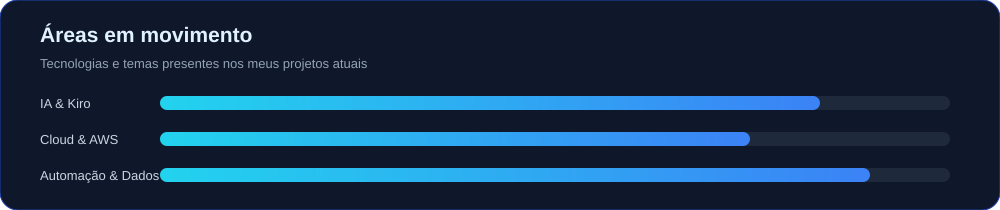

<!-- ========================================================= -->
<!-- HEADER ANIMADO -->
<!-- ========================================================= -->

<p align="center">
  
</p>

<p align="center">
  <strong>Construindo soluções que conectam negócio, tecnologia e impacto.</strong>
</p>

<p align="center">
  <a href="https://linkedin.com/in/arthur-martins-arantes">
    
  </a>

  <a href="https://github.com/ArthurMartinsarantes">
    
  </a>

  
</p>

---

# Perfil profissional

Sou **Engenheiro da Computação**, desenvolvedor e entusiasta de **Inteligência Artificial, Cloud Computing e automação**, com experiência no desenvolvimento de software, análise de dados, sistemas corporativos e digitalização de processos.

Atuo na criação de soluções tecnológicas aplicadas a **problemas reais de negócio**, utilizando diferentes tecnologias e plataformas.

Minha experiência envolve:

- 💻 Desenvolvimento de software
- 🤖 Inteligência Artificial
- ☁️ Cloud Computing
- ⚙️ Automação de processos
- 📊 Análise de dados
- 🌐 Desenvolvimento Web
- 🔗 Integração de sistemas
- 🏢 Sistemas corporativos
- 🧠 Engenharia de Prompt
- 🚀 Desenvolvimento assistido por IA

Tecnologias e plataformas com as quais trabalho:

**C# · JavaScript · Python · Java · React · Supabase · Power Platform · Power BI · AWS · SAP · IA Generativa**

---

# Sobre mim

<div align="center">

| Área | Informação |
|---|---|
| 🏢 **Atuação** | Assistente de Sistemas de TI · Bioenergética Aroeira |
| 🎓 **Formação** | Engenheiro da Computação |
| ☁️ **Comunidade** | Fundador e Líder · AWS User Group Tupaciguara |
| 🤖 **Foco atual** | Inteligência Artificial, Cloud e Automação |
| 💻 **Desenvolvimento** | Software, Web e Sistemas Empresariais |
| 📊 **Dados** | Power BI, Python, Pandas, Plotly e Streamlit |
| 🚀 **Interesse** | IA aplicada ao desenvolvimento de software |

</div>

---

# O que estou construindo

## 01 — AWS User Group Tupaciguara

Sou **Fundador e Líder do AWS User Group Tupaciguara**, comunidade voltada ao compartilhamento de conhecimento sobre computação em nuvem, inteligência artificial e desenvolvimento.

Atuo na:

- Organização de meetups
- Planejamento de eventos
- Criação de conteúdo técnico
- Condução de workshops
- Demonstrações práticas
- Compartilhamento de experiências
- Desenvolvimento de projetos com AWS

### ☕ 8º Meetup — Café com IA

Atualmente estou trabalhando no:

**8º Meetup AWS UG Tupaciguara — Café com IA ☕**

**Kiro: da ideia ao código com IA**

O encontro aborda de forma prática:

- 🤖 AWS Kiro
- 🧠 Engenharia de Prompt
- 💻 Desenvolvimento assistido por IA
- 🚀 Criação de projetos
- 🔧 Refatoração de código
- 🏗️ Estruturação de aplicações
- ☁️ Integração com AWS

A ideia é mostrar como utilizar IA não apenas para gerar código, mas como uma ferramenta presente durante todo o processo de desenvolvimento.

---

# 02 — Inteligência Artificial + AWS Kiro

Tenho explorado diferentes formas de utilizar IA no desenvolvimento de software, principalmente através do **AWS Kiro**.

Alguns dos experimentos e projetos envolvem:

- Engenharia de Prompt
- Análise de requisitos
- Geração de código
- Refatoração
- Análise de projetos existentes
- Desenvolvimento Web
- Integração com serviços AWS
- Automação
- Documentação
- Desenvolvimento assistido por IA
- Transformação de ideias em aplicações

Meu objetivo é explorar como a IA pode participar de diferentes etapas do ciclo de desenvolvimento.

---

# 03 — Arthur Engenharia & Tecnologia

Também estou construindo meu próprio espaço para apresentar meus projetos, experiências e experimentos tecnológicos.

### Principais áreas

- 💻 Desenvolvimento Web
- 🤖 Inteligência Artificial
- ⚙️ Automação
- ☁️ Cloud Computing
- 📊 Dados
- 🏢 Sistemas Empresariais
- 🔗 Integração de tecnologias
- 🚀 Desenvolvimento assistido por IA

O projeto funciona como um portfólio para apresentar soluções desenvolvidas e tecnologias utilizadas na prática.

---

# 04 — Sistemas Web e Aplicações Empresariais

Uma das soluções desenvolvidas foi para **Vazante Agropecuária / Destilaria Cachoeira**, envolvendo diferentes áreas do processo operacional.

### Tecnologias

- React
- Lovable
- Supabase
- Vercel
- JavaScript

### Funcionalidades

- 📦 Gestão de produção
- 🧪 Laboratório
- ⚖️ Balança
- 💰 Faturamento
- 🛢️ Controle de tanques
- 📊 Histórico
- 🔎 Rastreabilidade
- 📈 Indicadores
- 🔄 Processamento de dados
- 🧮 Cálculos específicos de produção

Esse projeto representa a aplicação de desenvolvimento de software em um **problema real de negócio**, conectando tecnologia, dados e processos industriais.

---

# 05 — Automação e Dados

Também venho desenvolvendo soluções envolvendo análise de dados, automação e integração de informações.

### Tecnologias utilizadas

- 🐍 Python
- 🐼 Pandas
- 📊 Plotly
- 📈 Streamlit
- 📊 Power BI
- ⚡ Power Automate
- 🤖 Copilot Studio
- 🔗 APIs
- 📰 RSS
- ☁️ Serviços Cloud

Essas tecnologias são utilizadas em projetos relacionados a:

- Dashboards
- Automação de processos
- Integração de dados
- Monitoramento
- Business Intelligence
- Coleta de informações
- Processamento de dados
- Comunicação automatizada

---

# Tecnologias e ferramentas

<p align="center">


</p>

---

# Em movimento

<p align="center">
  
</p>

<p align="center">
  <strong>Projetando • Automatizando • Aprendendo • Compartilhando</strong>
</p>

---

# Atualmente explorando

```text
🤖 Inteligência Artificial
│
├── Engenharia de Prompt
├── Desenvolvimento assistido por IA
├── Agentes e ferramentas de IA
└── IA aplicada a negócios

☁️ Cloud Computing
│
├── AWS
├── Serviços Cloud
├── Integrações
└── Arquitetura de aplicações

💻 Desenvolvimento
│
├── C#
├── JavaScript
├── Python
├── Java
└── React

📊 Dados
│
├── Power BI
├── Pandas
├── Plotly
└── Streamlit

⚙️ Automação
│
├── Power Automate
├── Copilot Studio
├── APIs
└── Integração de sistemas
